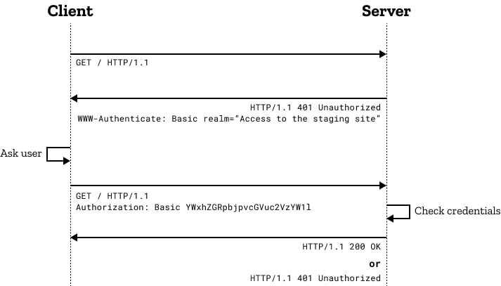

#Authentication 
## I. Learn basic Authentication
Refer to at [blog Dư Thanh Được](https://duthanhduoc.com/blog)

### 1. What is authentication?

- Authentication là quá trình xác thực người dùng nó giúp ta biết được người dùng là ai và có thể truy cập vào các loại tài nguyên nào.

  > Ví dụ :
  >
  > > Trong 1 ứng dụng web bạn muốn cho phép người dùng đăng nhập vào ứng dụng của bạn bạn sẽ làm như thế nào ?
  > > Bạn sẽ lưu thông tin đăng nhập vào database và khi người dùng muốn đăng nhập, thông tin sẽ được kiểm tra trong database nếu thôgn tin đăng nhập đúng người dùng sẽ truy cập vào được

- Authorization là quá trình xác định người dùng xem người đó được truy cập vào những loại tài nguyên nào
  > Ví dụ:
  >
  > > Người dùng A có thể xem được clip của B nhưng không được xem clip của C

Mức độ authentication > authorization

### 2. Luồng hoạt động của authentication

- Ngày nay có nhiều phương pháp authentication nhưng luồng của chúng cơ bản vẫn giống nhau
  > Bạn truy cập vào 1 trang web
  >
  > > - Bước 1: Client sẽ gửi 1 request lên server chứa thông tin định danh client (chứa thông tin hoặc 1 đoạn mã,token)
  > > - Bước 2: Server sẽ kiểm tra thông tin định danh nếu đúng trả về 1 dấu hiệu gì đó cho biết đăng nhập thành công
  > > - Bước 3: Client lưu lại dấu hiệu này và gửi dáu hiệu này và gửi lên server mỗi khi client muốn truy cập vào tài nguyên gì đó của server
  > > - Bước 4: server kiểm tra dấu hiệu nếu hợp lệ sẽ trả về tài nguyên cần thiết

### 3. Basic Authentication

> 3.1.Flow
>>* Khi bạn truy cập website sử dụng cơ chế Basic Authentication, server sẽ kiểm tra Authorization trong HTTP header. Nếu Authorization không hợp lệ, server sẽ trả về một response với WWW-Authenticate nằm trong header. Cái này nó sẽ làm website bạn hiển thị popup yêu cầu bạn nhập username/password.
>>* Bạn nhập username/password, bạn nhấn OK thì trình duyệt sẽ tiến hành mã hóa (encode) username/password thành một chuỗi base64 theo quy tắc username:password, và gửi lên server thông qua HTTP header Authorization.
>>* Server sẽ kiểm tra và giải mã Authorization trong HTTP header. Nếu hợp lệ, server sẽ trả về thông tin website, nếu không hợp lệ, server sẽ trả về một popup yêu cầu bạn nhập lại username/password.

> 3.2.Ưu và nhược điểm
>>*🥈Ưu điểm
>> *    Đơn giản, dễ hiểu, dễ triển khai. Làm được trên Nginx hay Apache luôn cũng được, không cần can thiệp vào code backend.
>*🥈Nhược điểm
>> *    Không an toàn, vì username/password được mã hóa bằng Base64. Kẻ gian có thể đánh cắp đoạn mã base64 này thông qua việc bắt request (Tấn công Man-in-the-middle). Vậy nên cần phải sử dụng HTTPS để mã hóa giao tiếp giữa client và server.
>>* Thiếu tính linh hoạt: Basic Authentication không hỗ trợ nhiều cấp độ xác thực, quản lý quyền truy cập, hay gia hạn/ thu hồi quyền truy cập. Điều này giới hạn khả năng mở rộng và kiểm soát truy cập trong các ứng dụng phức tạp.
>>*  Không thể logout khỏi website. Vì Basic Authentication chỉ yêu cầu người dùng nhập username/password khi truy cập vào website, nên khi bạn tắt trình duyệt, bạn mới logout ra.
>>*  Không thể sử dụng được cho các ứng dụng mobile. Vì Basic Authentication yêu cầu người dùng nhập username/password, nhưng trên các ứng dụng mobile thì không có giao diện để người dùng nhập username/password.
## II. Cookies and Session Authenticaion 
### 1. What is Cookie?
* Cookie là 1 file nhỏ được lưu trên thiết bị user. Cookie có thể lưu thông tin về người dùng như tên, địa chỉ, giỏ hàng,lịch sử truy cập,...
> Ví dụ khi bạn truy cập vào website facebook, và server fb trả về cookie thì trình duyệt của bạn sẽ lưu cookie cho domain fb.
Khi bạn gửi request đến https://facebook.com (bao gồm việc bạn enter url vào thanh địa chỉ hay gửi api đến) thì trình duyệt của bạn tìm kiếm có cookie nào của https://facebook.com không và gửi lên server https://facebook.com
Nhưng nếu bạn truy cập vào https://google.com thì google sẽ không đọc được cookie bên https://facebook.com, vì trình duyệt không gửi lên.

> [Lỗ hổng tấn công CSRF by code dạo anh Phạm Huy Hoàng](https://youtu.be/sVO984z809M?si=2_K4oRIKEuDNivIQ)

* Vấn đề làm rõ về cookie:
    * Cookie được lưu ở ổ cứng máy tính, nên tắt trình duyệt hoặc shutdown máy tính thì nó vẫn còn ở đấy
    * Có 3 cách để ghi dữ liệu lên cookie
        * Khi bạn truy cập vào 1 url hoặc gọi 1 api, server có thể set cookie lên máy tính của bạn bằng cách trả về header Set-Cookie trong response.
        * Bạn có thể dùng javascript để set cookie lên máy tính của bạn thông qua document.cookie
        * Bạn có thể dùng trình duyệt, mở devtool lên và set cookie lên máy tính của bạn
    * Khi bạn truy cập vào 1 url hoặc gọi 1 api, trình duyệt sẽ tự động gửi cookie lên server.
* Làm sao bảo vệ website khỏi CSRF?
Nếu bạn không dùng cookie thì không cần quan tâm, vì no cookie no CSRF.
    * Nếu bạn sài combo REST API và SPA thì đầu tiên là phải thiết lập cors, httpOnly=true, secure=true, SameSite=Strict hoặc SameSite=Lax.
    * Cẩn thận với SameSite=Strict:
    Vì nếu bạn set SameSite=Strict thì khi bạn đăng nhập vào example.com rồi. Bây giờ bạn click vào đường link example.com trên trang web khác thì trình duyệt sẽ không gửi cookie đâu, dẫn đến việc dù bạn đã đăng nhập lúc nãy nhưng vẫn bị chuyển về trang login vì bị cho là chưa đăng nhập.
    * Cái này thường xảy ra khi website của bạn là website theo MPA truyền thống, còn nếu là SPA thì không sao cả, vì hầu như các SPA chúng ta đều gọi request và gửi cookie lên server thông qua fetch hay XMLHttpRequest (tức là đã redirect đến trang) chứ không phải ngay khi click vào đường link.
    * Cá nhân mình nghĩ không cần phải dùng thêm CSRF token nữa, vì nó chỉ làm cho cơ chế xác thực của bạn phức tạp hơn thôi. Như trên là đủ rồi.
### 2. Session Authentication

> 2.1. Flow 
>>*  Client gửi request vào tài nguyên được bảo vệ trên server. Nếu client chưa được xác thực, server sẽ trả lời với một lời nhắc đăng nhập. Client gửi username và password của họ cho server.
>>*  Server xác minh thông tin xác thực được cung cấp so với cơ sở dữ liệu người dùng. Nếu thông tin xác thực khớp, server tạo ra một Session Id duy nhất và tạo một session tương ứng trong bộ nhớ lưu trữ phía server (ví dụ: ram, database, hoặc file nào đó).
>>*  Server gửi Session Id cho client dưới dạng cookie, thường là với tiêu đề Set-Cookie.
>>*  Client lưu trữ cookie.
>>*  Đối với các yêu cầu tiếp theo, client gửi cookie chứa Session Id lên server.
>>*  Server kiểm tra Session Id trong cookie so với dữ liệu session được lưu trữ để xác thực người dùng.
>>*  Nếu được xác nhận, server cấp quyền truy cập vào tài nguyên được yêu cầu. Khi người dùng đăng xuất hoặc sau một khoảng thời gian hết hạn được xác định trước, server làm vô hiệu phiên

> 2.2. Ưu và nhược điểm 
>>🥉Ưu điểm
>>* Dễ triển khai, hầu như mấy framework web hiện nay đều giúp bạn thực hiện session authentication một cách cực kỳ dễ dàng chỉ với vài dòng code
>>* Bảo mật thông tin người dùng. Như bạn thấy đấy, người dùng chỉ lưu một cái chuỗi ngẫu nhiên (session id) trên máy mình và gửi nó lên server qua mỗi request, nên mấy cái thông khác như username, password, ... không bị lộ ra ngoài
>>* Toàn quyền kiểm soát phiên làm việc của người dùng. Vì mọi thứ bạn lưu trữ ở server nên bạn có thể đăng xuất người dùng bất cứ khi nào bạn muốn bằng việc xóa session id của họ trong bộ nhớ lưu trữ phía server.
>🥉Nhược điểm
>>* Việc toàn quyền kiểm soát vừa là ưu điểm cũng vừa là nhược điểm của session authentication. Vì bạn phải lưu trữ thông tin phiên làm việc của người dùng nên bạn phải có một bộ nhớ lưu trữ phía server. Ví dụ bạn lưu trữ trên RAM thì không thể chia sẻ cho các server khác được (dính DDOS hay restart server lại mất hết), lưu trữ trên database thì lại tốn kém thêm chi phí, bộ nhớ,...
>>* Bộ nhớ lưu trữ session sẽ phình to rất nhanh vì mỗi khi có một người dùng đăng nhập thì bạn lại phải lưu trữ một session id mới, cái này phình to nhanh lắm đấy 😂
>>* Tốc độ chậm, vì mỗi request đến server, server điều phải kiểm tra trong bộ nhớ lưu trữ xem session id có hợp lệ hay không. Nếu bạn lưu trữ trên database thì tốc độ sẽ chậm hơn nữa.
>>* Khó khăn trong việc scale ngang server. Ví dụ khi server lớn lên, bạn phải có nhiều server để chịu tải hơn, thì việc chia sẻ session id giữa các server là một vấn đề khó khăn, kiểu gì bạn cũng phải tìm cái gì đó chung giữa các server như database chung chẳn hạn. Lại database, nếu nó lớn lên lại tìm cách scale database
## III. JWT (Json web token)
### 1. What is JWT?

